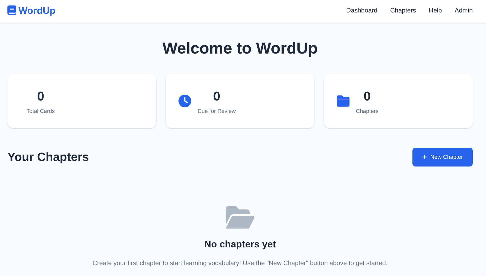

# WordUp - A Vocabulary Trainer

**WordUp** is a complete web-based vocabulary trainer designed for effective language acquisition using the scientifically proven **Leitner Spaced Repetition System (SRS)**. Built with Python and Flask, it provides a modern, responsive interface for managing and learning vocabulary across multiple languages.



## ✨ Features

### 📚 Vocabulary Management
- **Multi-Language Support**: Create chapters for any language pair (e.g., German ↔ English)
- **Flexible Card Creation**: Add vocabulary with source/target words, example sentences, and context hints
- **Bulk Import**: Import multiple cards at once using simple text format
- **Chapter Organization**: Organize vocabulary by topics, lessons, or difficulty levels
- **Context Hints**: Add descriptive context like "opposite", "synonym", "formal" to enhance learning

### 🧠 Learning System
- **Leitner SRS**: 5-box spaced repetition system with automatic scheduling
- **Directional Learning**: Practice source→target, target→source, or random directions
- **Active Recall**: Type translations rather than just rating difficulty
- **Practice Modes**: 
  - Due cards only (scheduled reviews)
  - All cards (practice mode)
  - Box-specific practice (focus on specific learning stages)

### 📊 Progress Tracking
- **Success Rates**: Track accuracy per chapter with detailed statistics
- **Box Distribution**: Visual representation of cards across the 5 Leitner boxes
- **Review History**: Complete history of all learning sessions
- **Due Card Counts**: See exactly how many cards need review

### ⚙️ Administration
- **Data Export**: Export individual chapters or full backups as JSON/ZIP
- **Data Import**: Import vocabulary from JSON files or ZIP archives
- **Statistics Reset**: Reset progress for chapters or entire system
- **Help System**: Comprehensive help with Leitner system explanation

## 🚀 Quick Start

### Prerequisites
- Python 3.12+ 
- [uv](https://github.com/astral-sh/uv) (recommended) or pip

### Installation

1. **Clone the repository**
   ```bash
   git clone https://github.com/unfinishe/wordup.git
   cd wordup
   ```

2. **Install dependencies**
   ```bash
   uv install
   # or with pip: pip install -e .
   ```

3. **Configure environment** (optional)
   ```bash
   cp .env.example .env
   # Edit .env with your preferences
   ```

4. **Run the application**
   ```bash
   uv run main.py
   # or: uv run python main.py
   ```

5. **Open your browser**
   Navigate to http://127.0.0.1:5000

## 🔧 Configuration

WordUp can be configured via environment variables or the `.env` file:

```bash
# Flask configuration
SECRET_KEY=your-secret-key-here
FLASK_DEBUG=true

# Database (optional - defaults to instance/wordup.db)
# Relative path: sqlite:///data/wordup.db
# Absolute path: sqlite:////absolute/path/to/wordup.db
DATABASE_URL=sqlite:///data/wordup.db

# Server configuration
WORDUP_HOST=127.0.0.1
WORDUP_PORT=5000
```

### Database Paths
- **Default**: Uses Flask instance folder (`instance/wordup.db`)
- **Relative**: Resolved relative to project root (`data/wordup.db`)
- **Absolute**: Used as-is (`/var/lib/wordup/wordup.db`)

## 📖 Usage

### Creating Your First Chapter
1. Click "Chapters" in the navigation
2. Click "New Chapter" 
3. Enter chapter name and language pair
4. Add vocabulary cards individually or use bulk import

### Bulk Import Format
```
source_word | target_word | example_sentence | context_hint
Hallo | Hello | Hallo, wie geht es dir? | greeting
laut | quiet | Das Radio ist zu laut | opposite
schnell | fast | | synonym
```

### Learning Sessions
1. Navigate to a chapter
2. Click "Start Learning Session"
3. Choose practice mode and settings
4. Type translations and receive immediate feedback
5. Cards automatically progress through the Leitner boxes

### The Leitner System
WordUp uses a 5-box Leitner system:
- **Box 1**: Review daily (new/difficult cards)
- **Box 2**: Review every 3 days 
- **Box 3**: Review weekly
- **Box 4**: Review bi-weekly  
- **Box 5**: Review monthly (mastered cards)

Correct answers move cards to the next box, incorrect answers return them to Box 1.

## 🐳 Docker Deployment

### Quick Start with Docker

**Using Docker Compose (Recommended):**
```bash
# Clone and build
git clone <repository-url>
cd wordup

# Start with docker-compose
docker-compose up -d

# Or for development with live reload
docker-compose -f docker-compose.yml up wordup-dev
```

**Using Docker directly:**
```bash
# Build the image
docker build -t wordup .

# Run with persistent data
docker run -d \
  --name wordup-app \
  -p 5000:5000 \
  -v wordup_data:/app/data \
  -e SECRET_KEY="your-secret-key" \
  wordup

# Or run interactively for testing
docker run --rm -p 5000:5000 wordup
```

### Docker Configuration

The Docker setup includes:
- **Multi-stage build** with optimized layer caching
- **Non-root user** for security
- **Health checks** for container monitoring  
- **Volume mounts** for database persistence
- **Environment variables** for configuration

**Key Docker paths:**
- Database: `/app/data/wordup.db` or `/app/instance/wordup.db`
- Application: `/app`
- Config: Environment variables (see `.env.docker`)

## 🛠️ Development

### Project Structure
```
wordup/
├── src/
│   ├── app.py              # Flask application factory
│   ├── models/__init__.py  # SQLAlchemy models
│   ├── routes/             # Flask blueprints
│   │   ├── main.py         # Dashboard and help
│   │   ├── chapters.py     # Chapter management
│   │   ├── cards.py        # Vocabulary cards
│   │   ├── learning.py     # Learning sessions
│   │   └── admin.py        # Export/import
│   ├── services/
│   │   └── srs.py          # Leitner system logic
│   ├── templates/          # Jinja2 templates
│   └── static/             # CSS and JavaScript
├── main.py                 # Application entry point
├── pyproject.toml          # Dependencies
└── .env.example            # Configuration template
```

### Adding Features
1. **Models**: Extend `src/models/__init__.py` for new data structures
2. **Routes**: Add blueprints in `src/routes/` for new functionality  
3. **Templates**: Create Jinja2 templates in `src/templates/`
4. **Styles**: Modify `src/static/style.css` for UI changes
5. **Logic**: Extend `src/services/srs.py` for SRS modifications

### Database Migrations
WordUp uses SQLAlchemy with automatic table creation. For schema changes:
1. Modify models in `src/models/__init__.py`
2. Delete existing database file (for development)
3. Restart application to recreate tables

## 🧪 Testing

Manual testing approaches:
- **Export/Import**: Test data preservation with admin features
- **Learning Sessions**: Verify SRS logic with different answer patterns
- **Responsive Design**: Test on mobile and desktop browsers
- **Database**: Verify data integrity across operations

## 📝 License

This project is licensed under the MIT License - see the [LICENSE](LICENSE) file for details.

## 🤝 Contributing

1. Fork the repository
2. Create a feature branch (`git checkout -b feature/amazing-feature`)
3. Commit your changes (`git commit -m 'Add amazing feature'`)
4. Push to the branch (`git push origin feature/amazing-feature`)
5. Open a Pull Request

## 📧 Support

For questions or issues:
- Open an issue on GitHub
- Check the built-in help system (Help → WordUp Help Guide)
- Review the Leitner system documentation in the app

## 🙏 Acknowledgments

- **Leitner System**: Based on Sebastian Leitner's spaced repetition research
- **Flask**: Web framework powering the application
- **SQLAlchemy**: ORM for database management
- **Font Awesome**: Icons used throughout the interface